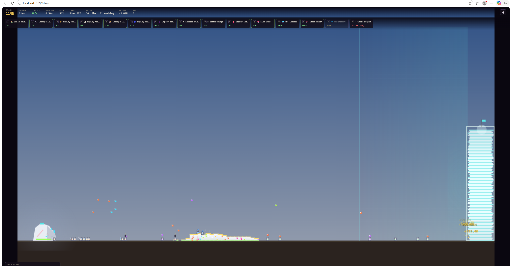
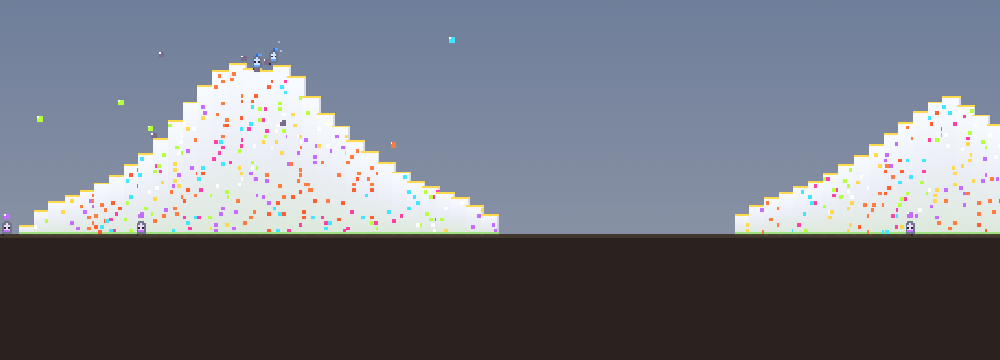

# SHARDFALL

A tiny idle/incremental game about a swarm of little **motes** chipping a rock to bits.
Built from scratch with an HTML5 canvas and vanilla JS (Vite). No frameworks, no assets —
the pixel art, the synth blips, and the economy are all generated in code.



## The loop

It's a balancing act between two rates:

- **Damage** — motes hit the rock (far left); each shard lands on the ground at a distance set by **range**.
- **The pile** — shards stack into a heap between the rock and the stash. If the pile grows tall *near the rock*, the rock **claws it back** (reclamation) — so you must keep shards moving rightward and the pile low.
- **Collection** — runners, tossers, and your own clicks move pile shards into the **stash** (far right). The stash is your currency.

Spend shards on more motes and upgrades, **crack the rock deeper** for richer shards, and **ascend** for a permanent boost. The whole game is keeping *collection* in step with *damage* while the rock fights you for the pile.



## The motes

Six kinds of worker, each with a job (and its own little sprite):

| Mote | Job |
|------|-----|
| 🔨 **Slammer** | Bulk damage, shards land mid-field |
| 🏃 **Runner** | Hauls stash-side shards into the stash |
| ⛰ **Mountaineer** | Stomps the pile flatter, cutting reclamation |
| 🏹 **Slinger** | Ranged damage — shards land right by the stash |
| 🌀 **Tosser** | Telekinetically lobs far shards across the gap |
| 💣 **Bomber** | Bursts a wide spray of shards off the rock |

You grow the workforce by building **Housing** (motes arrive on a cooldown), then employ idle motes into roles.


## Design notes

The economy keeps shard **count** moderate (so collection can always keep pace with damage at every tier) while all the exponential growth lives in shard **value** — tiers multiply what each shard is worth, Refinement adds a capped bump, and ascension multiplies everything. Reclamation is *proximity-weighted*: brutal near the rock, harmless near the stash, which makes Range, Slingers, Mountaineers, and collectors all meaningfully interact.

## Run it

```bash
npm install
npm run dev
```

Then open the local URL Vite prints (default `http://localhost:5173`).

## Controls

- **Click the rock** to slam it by hand (great for bootstrapping).
- **Click/drag the pile** to scoop shards toward the stash.
- **Number/letter keys** (shown on each chip) buy the matching upgrade.
- Progress autosaves to local storage.

## Tech

Vanilla JavaScript + a single `<canvas>` rendered at a fixed 960×540 internal resolution and scaled up nearest-neighbour for crisp pixels. DOM overlay for the HUD. Tiny WebAudio synth for sound. That's it.

---

*An original game. Made for fun.*
